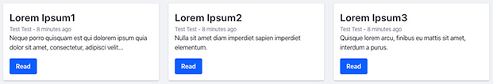

# [LFUG #20 Meetup](https://www.meetup.com/fr-FR/Liferay-France-User-Group/events/268839005/) | React Workshop

**Workshop**: Build and deploy a React app in Liferay.

The goal is to display a list of blogs published in Liferay. We will use GraphQL APIs
to fetch this list, and use [Apollo](https://www.apollographql.com/) as a GraphQL client.
We will use Basic authentication during development, and use Session authentication when deployed to Liferay.
We will display blogs as cards using [Clay](https://clayui.com/) components library.
In each card, we want to diplay the title, subtitle, author and date. It should look something like this:



## Getting Started

### From scratch
To do this workshop step by step, clone this repo on `develop` using HTTPS or SSH:

```shell
git clone -b develop https://github.com/lgdd/lfug20-react-workshop.git
# or
git clone -b develop git@github.com:lgdd/lfug20-react-workshop.git
```

Then, verify the [requirements](#requirements) and go the [steps section](#steps).

### Final result

If you want to try the final result, clone this repo on `master` using HTTPS or SSH:

```shell
git clone https://github.com/lgdd/lfug20-react-workshop.git
# or
git clone git@github.com:lgdd/lfug20-react-workshop.git
```

Then, verify the [requirements](#requirements). [Initialize your Liferay bundle](#initialize-liferay-bundle) and [start it](#start-liferay). [Add some blog posts](#https://portal.liferay.dev/docs/7-2/user/-/knowledge_base/u/adding-blog-entries) or generate them with the [Dummy Factory](#dummy-factory-optional) plugin. Go to `modules/lfug-react-app`, create a file named `.env.local` and [add your environment variables](#add-environment-variables). Run `yarn` or `npm install`.
Finally to test the app you can run `yarn start` or `npm run start` and it should open automatically a page to `http://localhost:3000` when started. You can also deploy this app to Liferay using `yarn deploy:liferay` or `npm run deploy:liferay`, login to your Liferay instance and [add `lfug-react-app` widget to a page](https://portal.liferay.dev/docs/7-2/user/-/knowledge_base/u/creating-widget-pages#adding-widgets-to-a-page) (e.g. _Home_ by default).

## Table of Contents

 - [Getting Started](#getting-started)
   - [From scratch](#from-scratch)
   - [Final result](#final-result)
 - [Table of Contents](#table-of-contents)
 - [Requirements](#requirements)
   - [System](#system)
   - [Tools](#tools)
     - [Blade (optional)](#blade-optional)
     - [Yeoman](#yeoman)
     - [Liferay JS Yeoman Generator](#liferay-js-yeoman-generator)
     - [Dummy Factory (optional)](#dummy-factory-optional)
 - [Steps](#steps)
   - [Git](#git)
   - [Overview](#overview)
 - [Cheat Sheet](#cheat-sheet)
     - [Using a local archive to initialize Liferay Bundle](#using-a-local-archive-to-initialize-liferay-bundle)
     - [Initialize Liferay Bundle](#initialize-liferay-bundle)
     - [Start Liferay](#start-liferay)
     - [Stop Liferay](#stop-liferay)
     - [Display Liferay logs](#display-liferay-logs)
     - [Create React app](#create-react-app)
     - [Start React app](#start-react-app)
     - [Add dotenv dependencies](#add-dotenv-dependencies)
     - [Add environment variables](#add-environment-variables)
     - [Access environment variables](#access-environment-variables)
     - [Add Clay dependencies](#add-clay-dependencies)
     - [Add GraphQL & Apollo dependencies](#add-graphql--apollo-dependencies)
     - [Truncate text](#truncate-text)
     - [Add Moment.js dependencies](#add-momentjs-dependencies)
     - [Adapt your app for Liferay](#adapt-your-app-for-liferay)
     - [Build your app for Liferay](#build-your-app-for-liferay)
     - [Deploy your app to Liferay](#deploy-your-app-to-liferay)
     - [Encode credentials to Base64](#encode-credentials-to-base64)
     - [Access Liferay JavaScript object](#access-liferay-javascript-object)
 - [Docs](#docs)
 - [License](#license)

## Requirements

### System

- **JDK** [1.8](https://docs.aws.amazon.com/corretto/latest/corretto-8-ug/downloads-list.html)
- **Node.js** >= 10.18
- **npm** >= 6.13 _or_ **Yarn** >= 1.22
> If you have any issue with permissions or to manage multiple Node.js / npm versions, I would recommend that you use [nvm](https://github.com/nvm-sh/nvm#installing-and-updating).

### Tools

**Altair** (GraphQL client for testing)

https://altair.sirmuel.design/docs/

#### Blade (optional)

https://portal.liferay.dev/docs/7-2/reference/-/knowledge_base/r/installing-blade-cli

#### Yeoman

```shell
npm install -g yo
```

#### Liferay JS Yeoman Generator

```shell
npm install -g generator-liferay-js
```

#### Dummy Factory (optional)

```shell
curl -o bundles/deploy/liferay.dummy.factory-7.2.3.jar https://raw.githubusercontent.com/yasuflatland-lf/liferay-dummy-factory/master/latest/liferay.dummy.factory-7.2.3.jar
# or
wget -O bundles/deploy/liferay.dummy.factory-7.2.3.jar https://raw.githubusercontent.com/yasuflatland-lf/liferay-dummy-factory/master/latest/liferay.dummy.factory-7.2.3.jar
```

> It will help you test your app by generating dummy Blog posts.
> To access to this plugin in Liferay, go to `Control Panel > Apps > Dummy Factory`.

## Steps

### Git

Each step of this workshop is represented by a git branch (e.g `steps/01-create-react-app`) and its commits (e.g. `Add Blog component`).

This will help you to compare your current work with what needs to be achieve, catch up with the group and, of course, allow you to complete this workshop on your own if you didn't attend this event.

### Overview

You'll a list of useful commands in the [Cheat Sheet](#cheat-sheet) section to help you complete the steps described below.

- Initialize your dev environment (check system requirements, clone this repo).
- Start your Liferay Bundle and login with `test@liferay.com` / `test`.
- Create or [generate](#dummy-factory-optional) at least 2 blog posts.
- Create your React app under a subfolder `modules`.
- Remove the following files that we won't be using: `App.test.js`, `logo.svg`, `index.css`.
- Add a `Blog` component using [Clay](https://clayui.com/docs/components/card.html).
- Add a `BlogList` component.
- Add a GraphQL client in `App.js` using [Apollo](https://www.apollographql.com/).
- Update your `BlogList` to fetch blog posts from your Liferay instance. You will need the id, title, body and published date. Use [Moment.js](https://www.npmjs.com/package/react-moment#from-now) to enhance date display.
- Adapt your React app for Liferay (use `liferay-js:adapt`, use Liferay session for the authentication and update your code to check if the user is logged in and condition the rendering).

## Cheat Sheet

#### Using a local archive to initialize Liferay Bundle

If you have already downloaded the [Liferay CE 7.2 GA2 Tomcat Bundle](https://sourceforge.net/projects/lportal/files/Liferay%20Portal/7.2.1%20GA2/), you can customise your Gradle properties to avoid the next step to download it again. Create a file named `gradle-local.properties` to the root folder and add:

```properties
# Example
liferay.workspace.bundle.url=file:///home/user/Downloads/liferay-ce-portal-tomcat-7.2.1-ga2-20191111141448326.tar.gz
```

> Where `/home/user/Downloads/liferay-ce-portal-tomcat-7.2.1-ga2-20191111141448326.tar.gz` is the location of your downloaded bundle.

#### Initialize Liferay Bundle

```shell
blade gw initBundle
# or
./gradlew initBundle
```

#### Start Liferay

```shell
blade server start
# or
./bundles/tomcat-9.0.17/bin/startup.sh
```

#### Stop Liferay

```shell
blade server stop
# or
./bundles/tomcat-9.0.17/bin/shutdown.sh
```

#### Display Liferay logs

```shell
tail -f bundles/tomcat-9.0.17/logs/catalina.out
```

#### Create React app

```shell
npx create-react-app modules/lfug-react-app
```

#### Start React app

```shell
yarn start
# or
npm run start
```

#### Add dotenv dependencies

```shell
yarn add dotenv
# or
npm install dotenv
```

> See [dotenv](https://github.com/motdotla/dotenv#dotenv).

#### Add environment variables

```properties
REACT_APP_LIFERAY_USER='test@liferay.com'
REACT_APP_LIFERAY_PASSWORD='test'
REACT_APP_LIFERAY_HOST='http://localhost:8080'
REACT_APP_LIFERAY_GRAPHQL_ENDPOINT='/o/graphql'
```

#### Access environment variables

```jsx
const nodeEnv = process.env.NODE_ENV;
const user = process.env.REACT_APP_LIFERAY_USER;
const password = process.env.REACT_APP_LIFERAY_PASSWORD;
const host = process.env.REACT_APP_LIFERAY_HOST;
const endpoint = process.env.REACT_APP_LIFERAY_GRAPHQL_ENDPOINT;
```

#### Add Clay dependencies

```shell
yarn add @clayui/css @clayui/alert @clayui/button @clayui/card @clayui/loading-indicator
# or
npm install @clayui/css @clayui/alert @clayui/button @clayui/card @clayui/loading-indicator
```

#### Add GraphQL & Apollo dependencies

```shell
yarn add graphql @apollo/react-hooks apollo-boost apollo-link-context
# or
npm install graphql @apollo/react-hooks apollo-boost apollo-link-context
```

#### Truncate text

React text truncate:

```shell
yarn add react-text-truncate
# or
npm install react-text-truncate
```

Snippet:

```jsx
import TextTruncate from 'react-text-truncate';

<TextTruncate
  line={3}
  element="span"
  truncateText="…"
  text="Lorem ipsum dolor sit amet, consectetur adipiscing elit. Maecenas hendrerit urna a dolor blandit suscipit. Aenean non turpis nec ex vestibulum tempor."
/>;
```

> We will truncate the blog post body.

#### Add Moment.js dependencies

```shell
yarn add moment react-moment
# or
npm install moment react-moment
```

#### Adapt your app for Liferay

```shell
yo liferay-js:adapt
```

#### Build your app for Liferay

```shell
yarn build:liferay
# or
npm run build:liferay
```

#### Deploy your app to Liferay

```shell
yarn deploy:liferay
# or
npm run deploy:liferay
```

#### Encode credentials to Base64

JavaScript:

```jsx
const credentials = new Buffer(`${user}:${password}`).toString('base64');
```

Shell:

```shell
openssl base64 <<< test@liferay.com:test
```

> **[Warning](https://portal.liferay.dev/docs/7-2/frameworks/-/knowledge_base/f/authenticated-requests#basic-authentication):** Encoding a string as shown here does not encrypt the resulting
> string. The encoded string can easily be decoded by executing
> `base64 <<< the-encoded-string`, which returns the original string.
> Anyone listening to your request could therefore decode the `Authorization`
> header and reveal your user name and password. To prevent this, ensure that
> all communication is made through HTTPS, which encrypts the entire message
> (including headers).

#### Access Liferay JavaScript object

```jsx
export function Liferay() {
  return window['Liferay'];
}
```

> See [Liferay JavaScript APIs](https://portal.liferay.dev/docs/7-1/tutorials/-/knowledge_base/t/liferay-javascript-apis)

## Docs

- https://github.com/liferay/liferay-js-toolkit/wiki
- https://portal.liferay.dev/docs/7-2/frameworks/-/knowledge_base/f/get-started-discover-the-api
- https://portal.liferay.dev/docs/7-1/tutorials/-/knowledge_base/t/liferay-javascript-apis
- https://www.apollographql.com/docs/tutorial/queries/#fetching-a-list
- https://clayui.com/docs/components/card.html
- https://github.com/motdotla/dotenv#dotenv
- https://reactjs.org/docs/getting-started.html
- https://graphql.org/learn/

## License

[MIT](LICENSE)
